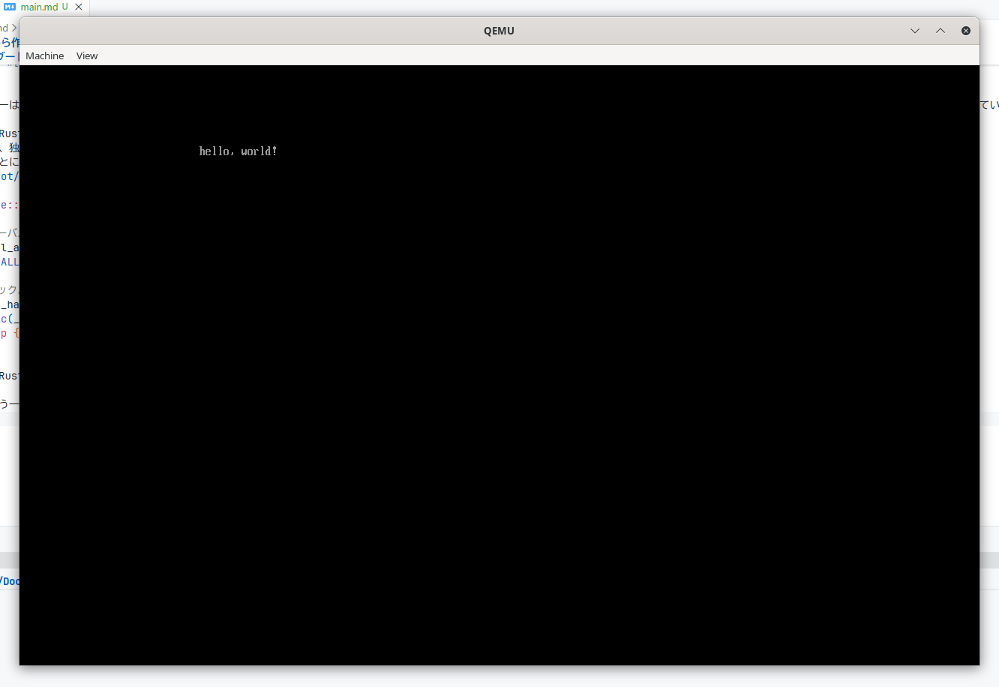

# ゼロから作るMyOS
皆さんは、コンピュータの基本的な仕組みを理解していますか？
この本（本...？）では、ゼロから自分だけのオペレーティングシステム（OS）を作成する方法を学べます。

OSは、ハードウェアとソフトウェアの橋渡しをする重要な役割を果たしています。
OSを理解することによって、コンピュータの動作原理やプログラミングの基礎を深く学ぶことができますよ！

では、Let's make your own OS!

この本では、以下の内容をカバーします：
- OSの基本概念
- ブートローダーの作成
- カーネルでの「Hello, World!」の表示
- メモリ管理の基礎

## はじめに
この本を手に取ったあなたは、ある程度OSに興味があるのでしょう。
ですが、実際のところOSって何？という人も多いと思います。
なので、まずはOSの基本的な概念から説明します。

OSとは、コンピュータのハードウェア（CPUやメモリなど）とソフトウェア（Word, Chrome, カウンターストライクなどなど...）の間に位置するソフトウェアのことです。
OSは、ハードウェアのリソース（メモリなどの限られた資源）を管理し、アプリケーションがそれらのリソースを効率的に利用できるようにします。
例えば、OSはメモリをアプリに割り当てたり、ファイルシステム（これがないとtest.txtすら保存できません）の管理、マルチタスク（Youtube見たりしながら開発したり、ゲームしながらTwitter見たりするにはこれが必須）などを担当します。
まぁ、要は、OSはコンピュータの管制塔てきなものです。

...いや、OSについて理解はしたけどそもそもOSって開発できるんですか？と思うかもしれません。いいえ、全然可能です！

なぜなら、OSといってもここで作るのは非常にシンプルなものだからです。
実際のOSは非常に複雑で、多くの機能を持っていますが、ここでは基本的な部分に焦点を当てます。
この本を通じて、OSの基本的な仕組みを理解し、自分でOSを作成する楽しさを体験してください！

追記: この本は初心者向けに書かれていますが、ある程度のプログラミング経験（特にRustやアセンブリ言語）があると理解が深まります。

### 必要なツール
OS開発を始めるにあたって、いくつかのツールが必要です。
以下に、必要なツールとそのインストール方法を説明します。
> Windowsの場合、WSL（Windows Subsystem for Linux）を使用することをお勧めします。WSLを使用すると、Linux環境での開発が可能になります。詳細は[公式ドキュメント](https://docs.microsoft.com/ja-jp/windows/wsl/install)を参照してください。

1. **Rust**: Rustはモダンなシステムプログラミング言語で、OS開発に適しています。公式サイト（https://www.rust-lang.org/ja/tools/install）からインストールしてください。
2. **QEMU**: QEMUはオープンソースの仮想化ソフトウェア（PCの上にPCを構築することができます）で、OSのデバッグに使用します。公式サイト（https://www.qemu.org/download/）からインストールしてください。
3. お好きなテキストエディタ: Vim, Emacs, VScodeなど好きなエディタを使用してください。メモ帳でもgoodです :D

これらのツールをインストールしたら、次の章から実際にOS開発を始めましょう！

## 1. ブートローダーの作成
OSを起動するためには、まずブートローダーを作成する必要があります。
ブートローダーは、コンピュータの電源が入ったときに最初に実行されるプログラムで、OSのカーネルをメモリにロードし、実行します。
ですが、とりあえず「動く」というのを大事にするので、ここでは非常にシンプルなブートローダーを作成します。
本来ならば、ブートローダーは`/EFI/BOOT/BOOTX64.EFI`に配置する必要がある（UEFI仕様）ですが、ここではQEMUを使用するため、特別な配置は必要ありません。
めんどっちいことは抜きにして、さっそくコードを書いていきましょう！

まずはテンプレートをクローンしてきます。
```bash
git clone https://github.com/nekogakure/CreateMyOS.git myos
git fetch
git checkout init
cd myos
```

dependenciesとは、Rustで使用できるライブラリ（クレートと呼ばれます）を指定する場所です。ライブラリを追加することで、OS開発を効率的に、簡単に進めることができるようになります！

次に、ブートローダーを配置するためのディレクトリを`src/boot`として作成します。
そうしたら、`src/boot/loader.rs`というファイルを作成し、以下のコードを追加します。
```rust
#![no_std]
#![no_main]

use uefi::prelude::*;

#[entry]
fn main(_image_handle: Handle, mut system_table: SystemTable<Boot>) -> Status {
    if let Err(_) = uefi::helpers::init(&mut system_table) {
        return Status::UNSUPPORTED;
    }

    let _ = system_table.stdout().clear();
    let _ = system_table
        .stdout()
        .output_string(cstr16!("hello, world!\n"));

    loop {}
}
```

では、さっそく実行してみましょう！
```bash
cargo run
```

...あれれ？？

```bash
neko@nek0dev:~/Documents/myos$ cargo run
error: failed to parse manifest at `/home/neko/Documents/myos/Cargo.toml`

Caused by:
  no targets specified in the manifest
  either src/lib.rs, src/main.rs, a [lib] section, or [[bin]] section must be present
```

おっと、エラーが出てしまいましたね。
これは、Cargoがどのファイルを実行すれば良いのか分からないために発生しています。
そこで、`Cargo.toml`ファイルに以下の内容を追加します。

```toml
[[bin]]
name = "boot"
path = "src/boot/loader.rs"
```

見栄えのために、これは一番下に追加するのが良いでしょう。
これで、Cargoは`src/boot/loader.rs`ファイルを実行することができます。（`[[bin]]`セクションについてもっと知りたい場合は、[公式ドキュメント](https://doc.rust-lang.org/cargo/reference/cargo-targets.html#binaries)を参照してください。）

では、もう一度実行してみましょう！

```bash
cargo run
```

ありゃ、またエラーが出てしまいましたね。
```bash
error: no global memory allocator found but one is required; link to std or add `#[global_allocator]` to a static item that implements the GlobalAlloc trait

error: `#[panic_handler]` function required, but not found
```

このエラーは、Rustがメモリを管理するためのアロケータ（メモリ割り当てなどを行う仕組み）とパニックハンドラ（プログラムが予期しないエラーに遭遇したときに呼び出される関数）が見つからないために発生しています。
普段ならRustの標準ライブラリに含まれているのですが、OS開発では、標準ライブラリ（`std`）を使用できません。
そのため、独自のアロケータとパニックハンドラを実装する必要があります。
幸いなことに、`uefi`クレートにはこれらの実装が含まれているため、簡単に解決できます。
`src/boot/loader.rs`ファイルの先頭に以下の行を追加します。
```rust
use core::panic::PanicInfo;

// グローバルアロケータの設定
#[global_allocator]
static ALLOCATOR: uefi::alloc::Allocator = uefi::alloc::Allocator;

// パニックハンドラの実装
#[panic_handler]
fn panic(_info: &PanicInfo) -> ! {
    loop {}
}
```
これで、Rustは`uefi`クレートのアロケータと、独自実装したパニックハンドラを使用することができます。

では、もう一度実行してみましょう！（先ほどと同じコマンドです）


こんな感じで、QEMUのウィンドウが開き、「hello, world!」と表示されれば成功です！

お疲れさまでした！これで、最初の基礎的なOSの一部が完成しました。
次の章では、カーネルを作成して、四角形を表示する方法を学びます。

ここまで理解できたあなたは素晴らしいと思います！ブートさせること自体が、一つ目の大きな山なので。

## 2. カーネルの作成
ブートローダーが完成したので、次はカーネルを作成しましょう。
カーネルって何？と思うと思います。

カーネルはOSの中心的な部分で、ハードウェアとソフトウェアの間の橋渡しをします。

カーネルは、メモリ管理、プロセス管理、ファイルシステム管理など、OSの基本的な機能を提供します。
有名なカーネルには、LinuxカーネルやWindows NTカーネルなどがあります。
カーネルがないとOSは成り立ちませんし、カーネルが存在しないOSはOSと言えません。つまり、脳みそであり心臓である部分です。

ここでは、非常にシンプルなカーネルを作成し、四角形を表示する方法を学びます。

カーネルは`src/kernel`ディレクトリに配置していきます。
まずは、`src/kernel/lib.rs`というファイルを作成し、以下のコードを追加します。
```rust
#![no_std]
#![feature(abi_x86_interrupt)]
#![allow(unused)]
#![deny(clippy::unwrap_used)]
#![deny(clippy::expect_used)]

/// カーネル本体
pub mod kernel;
```

いまはまだ寂しいですね。ですが、機能が増えるにつれて賑やかになっていきます！

次に、`src/kernel/kernel.rs`というファイルを作成し、以下のコードを追加します。
これはカーネルのエントリーポイントとなる関数を定義します。
```rust
/// カーネルエントリーポイント
#[unsafe(no_mangle)]
pub extern "C" fn kernel_entry() -> ! {
    loop {}
}
```

まだ何もしていませんが、これでカーネルのメインとなる関数が定義されました。今後は、ここに機能を追加していきます。

さて、このままだとカーネルは実行されません。（当たり前ですが...）
そこで、ブートローダーからカーネルを呼び出す必要があります。
`src/boot/loader.rs`ファイルを開き、以下のように最後にカーネルを呼び出すコードを追加します。

```diff
#![no_std]
#![no_main]

use uefi::prelude::*;
use core::panic::PanicInfo;
+ use kernel::kernel::kernel_entry;

extern crate alloc;

#[global_allocator]
static ALLOCATOR: uefi::allocator::Allocator = uefi::allocator::Allocator;

// パニックハンドラの実装
#[panic_handler]
fn panic(_info: &PanicInfo) -> ! {
    loop {}
}

#[entry]
fn main(_image_handle: Handle, mut system_table: SystemTable<Boot>) -> Status {
    if let Err(_) = uefi::helpers::init(&mut system_table) {
        return Status::UNSUPPORTED;
    }

    let _ = system_table.stdout().clear();
    let _ = system_table
        .stdout()
        .output_string(cstr16!("Starting MyOS...\n"));
+
+    // ブートサービスの終了
+    let _ = unsafe { system_table.exit_boot_services(uefi::table::boot::MemoryType::LOADER_DATA) };
+
+    kernel_entry();

-    loop {}
}
```

`let (_system_table, memory_map_iter) = unsafe { system_table.exit_boot_services(...) };`の部分は、UEFIのブートサービスを終了させるためのコードです。
UEFIのブートサービスを終了させることで、OSがハードウェアを直接制御できるようになります。
逆にこれをしないと、UEFIがハードウェアを制御し続けてしまい、OSの意味がなくなってしまいます。

では、さっそくビルド！...と言いたいところですが、このままだとカーネルがビルドされないため、`Cargo.toml`ファイルに以下の内容を追加します。（`[[bin]]`セクションの下あたりが良いでしょう。）

```toml
[lib]
name = "kernel"
path = "src/kernel/lib.rs"
```
これで、Cargoは`src/kernel/lib.rs`ファイルをライブラリとしてビルドします。
あれ？`kernel.rs`じゃないの？と思うかもしれませんが、`kernel.rs`にいろいろ機能を追加していくと、ファイルが肥大化してしまうため、`lib.rs`をライブラリとしてビルドし、`kernel.rs`をモジュールとしてインポートする形にしています。

では実行してみましょう！
```bash
cargo run
```
...あれれ？なにも表示されませんね。
当たり前です。今のままだとカーネルの`kernel_entry`関数は何もしていません。

では、どうやって四角形を表示させるかというと、UEFIのシステムテーブルをカーネルに渡して、ディスプレイに文字を表示させる必要があります。

しかし、現状のコードではシステムテーブルをカーネルに渡していません。
そこで、`kernel_entry`関数の引数にシステムテーブルを追加し、ブートローダーから渡すように変更します。
まず、`src/kernel/kernel.rs`ファイルを以下のように変更します。
```diff
+ pub extern "C" fn kernel_entry(boot_info: &'static BootInfo) -> ! {
```

次に、boot_info構造体を定義します。lib.rsの末尾に以下のコードを追加します。
```rust
#[repr(C)]
pub struct BootInfo {
    /// 物理メモリオフセット
    pub physical_memory_offset: u64,
    /// フレームバッファアドレス
    pub framebuffer_addr: u64,
    /// フレームバッファサイズ
    pub framebuffer_size: usize,
    /// 画面の幅（ピクセル）
    pub screen_width: usize,
    /// 画面の高さ（ピクセル）
    pub screen_height: usize,
    /// 1行あたりのバイト数
    pub stride: usize,
    /// メモリマップのアドレス
    pub memory_map_addr: u64,
    /// メモリマップのエントリ数
    pub memory_map_len: usize,
    /// メモリマップの各エントリサイズ
    pub memory_map_entry_size: usize,
}

/// メモリ領域の種類
#[derive(Debug, Clone, Copy, PartialEq, Eq)]
#[repr(C)]
pub enum MemoryType {
    /// 使用可能
    Usable,
    /// 予約済み
    Reserved,
    /// ACPIで再利用可能
    AcpiReclaimable,
    /// ACPI NVS
    AcpiNvs,
    /// 不良メモリ
    BadMemory,
    /// ブートローダーで使用中
    BootloaderReclaimable,
    /// カーネルスタック
    KernelStack,
    /// ページテーブル
    PageTable,
    /// フレームバッファ
    Framebuffer,
}

/// メモリマップエントリ
#[derive(Debug, Clone, Copy)]
#[repr(C)]
pub struct MemoryRegion {
    /// 開始アドレス
    pub start: u64,
    /// 長さ（バイト）
    pub len: u64,
    /// 領域の種類
    pub region_type: MemoryType,
}
```

メモリマップがうんたらかんたら...とありますが、今は気にしなくて大丈夫です。将来的にメモリ管理を実装する際に使用します。詳しくは各自調べてみてください。
そうしたら、ブートローダーからシステムテーブルを渡すように変更します。（diffを書く気力が出ないのでコードをそのまま載せます。）

```rust
#![no_std]
#![no_main]

extern crate alloc;

use kernel::kernel::kernel_entry;
use kernel::{BootInfo, MemoryRegion, MemoryType};
use uefi::prelude::*;
use uefi::proto::console::gop::GraphicsOutput;

#[global_allocator]
static ALLOCATOR: uefi::allocator::Allocator = uefi::allocator::Allocator;

static mut BOOT_INFO: BootInfo = BootInfo {
    physical_memory_offset: 0,
    framebuffer_addr: 0,
    framebuffer_size: 0,
    screen_width: 0,
    screen_height: 0,
    stride: 0,
    memory_map_addr: 0,
    memory_map_len: 0,
    memory_map_entry_size: 0,
};

// メモリマップを静的に保存
static mut MEMORY_MAP: [MemoryRegion; 256] = [MemoryRegion {
    start: 0,
    len: 0,
    region_type: MemoryType::Reserved,
}; 256];

/// UEFIエントリーポイント
#[entry]
fn main(_image_handle: Handle, mut system_table: SystemTable<Boot>) -> Status {
    if let Err(_) = uefi::helpers::init(&mut system_table) {
        return Status::UNSUPPORTED;
    }

    let _ = system_table.stdout().clear();
    let _ = system_table
        .stdout()
        .output_string(cstr16!("Starting MyOS...\n"));

    // Graphics Output Protocolを取得してフレームバッファ情報を保存
    let (fb_addr, fb_size, screen_w, screen_h, stride) = {
        let gop_handle = match system_table
            .boot_services()
            .get_handle_for_protocol::<GraphicsOutput>()
        {
            Ok(handle) => handle,
            Err(_) => return Status::UNSUPPORTED,
        };

        let mut gop = match system_table
            .boot_services()
            .open_protocol_exclusive::<GraphicsOutput>(gop_handle)
        {
            Ok(gop) => gop,
            Err(_) => return Status::UNSUPPORTED,
        };

        let mode_info = gop.current_mode_info();
        let mut framebuffer = gop.frame_buffer();

        (
            framebuffer.as_mut_ptr() as u64,
            framebuffer.size(),
            mode_info.resolution().0,
            mode_info.resolution().1,
            mode_info.stride(),
        )
    };

    // Boot Servicesを終了してメモリマップを取得
    let (_system_table, memory_map_iter) =
        unsafe { system_table.exit_boot_services(uefi::table::boot::MemoryType::LOADER_DATA) };

    // メモリマップを静的配列にコピー
    let map_count;
    unsafe {
        let mut count = 0;
        for (i, desc) in memory_map_iter.entries().enumerate() {
            if i >= 256 {
                break;
            }
            MEMORY_MAP[i] = MemoryRegion {
                start: desc.phys_start,
                len: desc.page_count * 4096,
                region_type: match desc.ty {
                    uefi::table::boot::MemoryType::CONVENTIONAL => MemoryType::Usable,
                    uefi::table::boot::MemoryType::ACPI_RECLAIM => MemoryType::AcpiReclaimable,
                    uefi::table::boot::MemoryType::ACPI_NON_VOLATILE => MemoryType::AcpiNvs,
                    uefi::table::boot::MemoryType::UNUSABLE => MemoryType::BadMemory,
                    uefi::table::boot::MemoryType::LOADER_CODE
                    | uefi::table::boot::MemoryType::LOADER_DATA => {
                        MemoryType::BootloaderReclaimable
                    }
                    _ => MemoryType::Reserved,
                },
            };
            count += 1;
        }
        map_count = count;
    }

    #[allow(static_mut_refs)]
    unsafe {
        BOOT_INFO.physical_memory_offset = 0;
        BOOT_INFO.framebuffer_addr = fb_addr;
        BOOT_INFO.framebuffer_size = fb_size;
        BOOT_INFO.screen_width = screen_w;
        BOOT_INFO.screen_height = screen_h;
        BOOT_INFO.stride = stride;
        BOOT_INFO.memory_map_addr = MEMORY_MAP.as_ptr() as u64;
        BOOT_INFO.memory_map_len = map_count;
        BOOT_INFO.memory_map_entry_size = core::mem::size_of::<MemoryRegion>();
    }

    unsafe {
        kernel_entry(&*core::ptr::addr_of!(BOOT_INFO));
    }
}
```

ああ、そういえばカーネルにもパニックハンドラが必要です。`src/kernel/kernel.rs`ファイルを以下のようにします
```rust
pub use crate::{BootInfo, MemoryRegion, MemoryType};

/// カーネルエントリーポイント
#[unsafe(no_mangle)]
pub extern "C" fn kernel_entry(boot_info: &'static BootInfo) -> ! {
    loop {}
}

#[panic_handler]
fn panic(_info: &core::panic::PanicInfo) -> ! {
    loop {}
}
```

では、この情報を使って、四角形を表示させましょう！
kernel.rsに書いても良いのですが、見通しが悪くなるので、新たに`src/kernel/display.rs`ファイルを作成し、以下のコードを追加します。

```rust
/// フレームバッファに矩形を描画
pub fn draw_rect(boot_info: &crate::BootInfo, x: usize, y: usize, w: usize, h: usize, color: u32) {
    let fb = boot_info.framebuffer_addr as *mut u32;
    let width = boot_info.screen_width;
    let height = boot_info.screen_height;
    let stride = boot_info.stride;

    for dy in 0..h {
        for dx in 0..w {
            let px = x + dx;
            let py = y + dy;
            if px < width && py < height {
                unsafe {
                    // strideはピクセル数
                    let offset = py * stride + px;
                    fb.add(offset).write_volatile(color);
                }
            }
        }
    }
}
```

次に、カーネルメインからこの関数を呼び出して四角形を表示させます。
```rust
pub use crate::display::draw_rect;
pub use crate::BootInfo;

#[unsafe(no_mangle)]
pub extern "C" fn kernel_entry(boot_info: &'static BootInfo) -> ! {
    // 画面左上に100x100の水色の四角形を描画
    draw_rect(boot_info, 0, 0, 100, 100, 0x0067A7CC);
    loop {}
}

#[panic_handler]
fn panic(_info: &core::panic::PanicInfo) -> ! {
    loop {}
}
```

では、さっそくビルドして実行してみましょう！
```bash
cargo run
```

うおおおお！でたぞ！！四角形が！！


今回は私の好きな水色にしてみました。色コードは`0x00RRGGBB`形式で指定します。
お疲れさまでした！これでカーネルから四角形を表示させることができました。
自由に色や位置、大きさを変えてみてください！

本当にお疲れさまでした！ここまで来たあなたは素晴らしいです！（というのも、筆者はここまで来るのにかなり苦労したことがあります。これができるだけでもすごいと思います！！！）