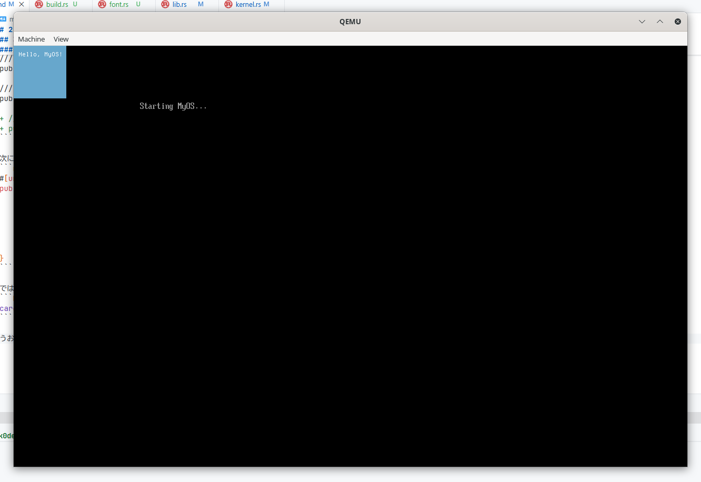
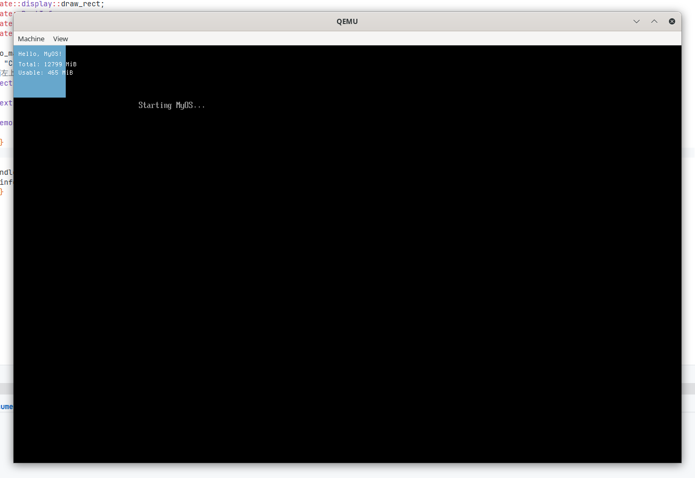
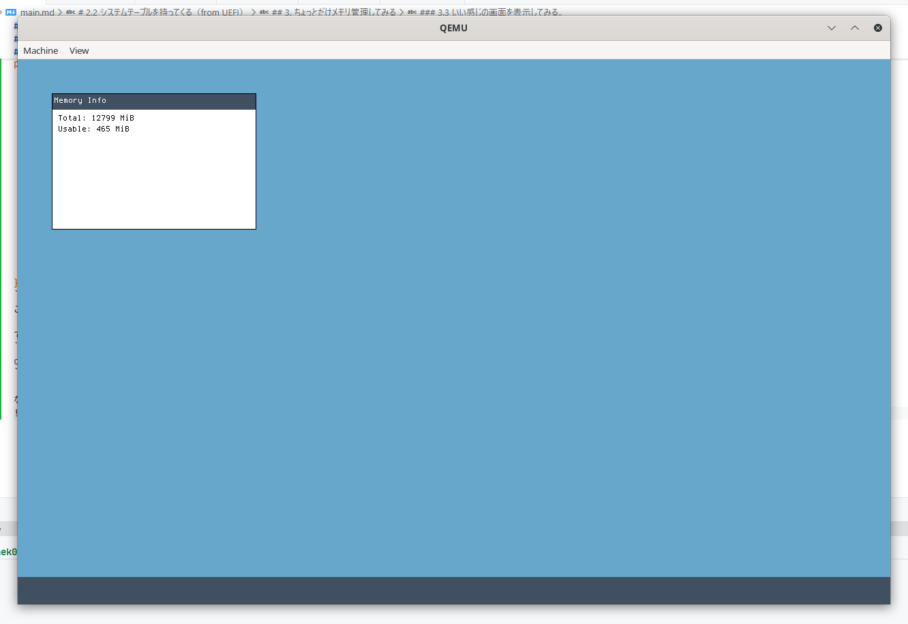

# ゼロから作るMyOS
皆さんは、コンピュータの基本的な仕組みを理解していますか？
この本（本...？）では、ゼロから自分だけのオペレーティングシステム（OS）を作成する方法を学べます。

OSは、ハードウェアとソフトウェアの橋渡しをする重要な役割を果たしています。
OSを理解することによって、コンピュータの動作原理やプログラミングの基礎を深く学ぶことができますよ！

では、Let's make your own OS!

この本では、以下の内容をカバーします：
- OSの基本概念
- ブートローダーの作成
- カーネルでの「Hello, World!」の表示
- メモリ管理の基礎

また、この本は中学生によって書かれたものであり、少し文章が拙い部分もあるかもしれませんが、ご了承ください。

## はじめに
おそらくあなたは、ある程度OSに興味があるのでしょう。
ですが、実際のところOSって何？という人も多いと思います。
なので、まずはOSの基本的な概念から説明します。

OSとは、コンピュータのハードウェア（CPUやメモリなど）とソフトウェア（Word, Chrome, カウンターストライクなどなど...）の間に位置するソフトウェアのことです。
OSは、ハードウェアのリソース（メモリなどの限られた資源）を管理し、アプリケーションがそれらのリソースを効率的に利用できるようにします。
例えば、OSはメモリをアプリに割り当てたり、ファイルシステム（これがないとtest.txtすら保存できません）の管理、マルチタスク（Youtube見たりしながら開発したり、ゲームしながらTwitter見たりするにはこれが必須）などを担当します。
まぁ、要は、OSはコンピュータの管制塔てきなものです。

...いや、OSについて理解はしたけどそもそもOSって開発できるんですか？と思うかもしれません。いいえ、全然可能です！

なぜなら、OSといってもここで作るのは非常にシンプルなものだからです。
実際のOSは非常に複雑で、多くの機能を持っていますが、ここでは基本的な部分に焦点を当てます。
この本を通じて、OSの基本的な仕組みを理解し、自分でOSを作成する楽しさを体験してください！

> 追記: この本は初心者向けに書かれていますが、ある程度のプログラミング経験（特にRustやアセンブリ言語）があると理解が深まります。

### 必要なツール
OS開発を始めるにあたって、いくつかのツールが必要です。
以下に、必要なツールとそのインストール方法を説明します。
> Windowsの場合、WSL（Windows Subsystem for Linux）を使用することをお勧めします。WSLを使用すると、Linux環境での開発が可能になります。詳細は[公式ドキュメント](https://docs.microsoft.com/ja-jp/windows/wsl/install)を参照してください。

1. **Rust**: Rustはモダンなシステムプログラミング言語で、OS開発に適しています。公式サイト（https://www.rust-lang.org/ja/tools/install）からインストールしてください。
2. **QEMU**: QEMUはオープンソースの仮想化ソフトウェア（PCの上にPCを構築することができます）で、OSのデバッグに使用します。公式サイト（https://www.qemu.org/download/）からインストールしてください。
3. お好きなテキストエディタ: Vim, Emacs, VScodeなど好きなエディタを使用してください。メモ帳でもgoodです :D

これらのツールをインストールしたら、次の章から実際にOS開発を始めましょう！

## 1. ブートローダーの作成
OSを起動するためには、まずブートローダーを作成する必要があります。
ブートローダーは、コンピュータの電源が入ったときに最初に実行されるプログラムで、OSのカーネルをメモリにロードし、実行します。
ですが、とりあえず「動く」というのを大事にするので、ここでは非常にシンプルなブートローダーを作成します。
本来ならば、ブートローダーは`/EFI/BOOT/BOOTX64.EFI`に配置する必要がある（UEFI仕様）ですが、ここではQEMUを使用するため、特別な配置は必要ありません。（直接EFIという実行ファイルを指定して起動できるため。）
めんどっちいことは抜きにして、さっそくコードを書いていきましょう！

まずはテンプレートをクローンしてきます。
```bash
git clone https://github.com/nekogakure/CreateMyOS.git myos
git fetch
git checkout init
cd myos
```

dependenciesとは、Rustで使用できるライブラリ（クレートと呼ばれます）を指定する場所です。ライブラリを追加することで、OS開発を効率的に、簡単に進めることができるようになります！

次に、ブートローダーを配置するためのディレクトリを`src/boot`として作成します。
そうしたら、`src/boot/loader.rs`というファイルを作成し、以下のコードを追加します。
```rust
#![no_std]
#![no_main]

use uefi::prelude::*;

#[entry]
fn main(_image_handle: Handle, mut system_table: SystemTable<Boot>) -> Status {
    if let Err(_) = uefi::helpers::init(&mut system_table) {
        return Status::UNSUPPORTED;
    }

    let _ = system_table.stdout().clear();
    let _ = system_table
        .stdout()
        .output_string(cstr16!("hello, world!\n"));

    loop {}
}
```

では、さっそく実行してみましょう！
```bash
cargo run
```

...あれれ？？

```bash
neko@nek0dev:~/Documents/myos$ cargo run
error: failed to parse manifest at `/home/neko/Documents/myos/Cargo.toml`

Caused by:
  no targets specified in the manifest
  either src/lib.rs, src/main.rs, a [lib] section, or [[bin]] section must be present
```

おっと、エラーが出てしまいましたね。
これは、Cargoがどのファイルを実行すれば良いのか分からないために発生しています。
そこで、`Cargo.toml`ファイルに以下の内容を追加します。

```toml
[[bin]]
name = "boot"
path = "src/boot/loader.rs"
```

見栄えのために、これは一番下に追加するのが良いでしょう。
これで、Cargoは`src/boot/loader.rs`ファイルを実行することができます。（`[[bin]]`セクションについてもっと知りたい場合は、[公式ドキュメント](https://doc.rust-lang.org/cargo/reference/cargo-targets.html#binaries)を参照してください。）

では、もう一度実行してみましょう！

```bash
cargo run
```

ありゃ、またエラーが出てしまいましたね。
```bash
error: no global memory allocator found but one is required; link to std or add `#[global_allocator]` to a static item that implements the GlobalAlloc trait

error: `#[panic_handler]` function required, but not found
```

このエラーは、Rustがメモリを管理するためのアロケータ（メモリ割り当てなどを行う仕組み）とパニックハンドラ（プログラムが予期しないエラーに遭遇したときに呼び出される関数）が見つからないために発生しています。
普段ならRustの標準ライブラリに含まれているのですが、OS開発では、標準ライブラリ（`std`）を使用できません。
そのため、独自のアロケータとパニックハンドラを実装する必要があります。
幸いなことに、`uefi`クレートにはこれらの実装が含まれているため、簡単に解決できます。
`src/boot/loader.rs`ファイルの先頭に以下の行を追加します。
```rust
use core::panic::PanicInfo;

// グローバルアロケータの設定
#[global_allocator]
static ALLOCATOR: uefi::alloc::Allocator = uefi::alloc::Allocator;

// パニックハンドラの実装
#[panic_handler]
fn panic(_info: &PanicInfo) -> ! {
    loop {}
}
```
これで、Rustは`uefi`クレートのアロケータと、独自実装したパニックハンドラを使用することができます。

では、もう一度実行してみましょう！（先ほどと同じコマンドです）


こんな感じで、QEMUのウィンドウが開き、「hello, world!」と表示されれば成功です！

お疲れさまでした！これで、最初の基礎的なOSの一部が完成しました。
次の章では、カーネルを作成して、四角形を表示する方法を学びます。

ここまで理解できたあなたは素晴らしいと思います！ブートさせること自体が、一つ目の大きな山なので。

## 2. カーネルの作成
ブートローダーが完成したので、次はカーネルを作成しましょう。
カーネルって何？と思うと思います。

カーネルはOSの中心的な部分で、ハードウェアとソフトウェアの間の橋渡しをします。

カーネルは、メモリ管理、プロセス管理、ファイルシステム管理など、OSの基本的な機能を提供します。
有名なカーネルには、LinuxカーネルやWindows NTカーネルなどがあります。
カーネルがないとOSは成り立ちませんし、カーネルが存在しないOSはOSと言えません。つまり、脳みそであり心臓である部分です。

ここでは、非常にシンプルなカーネルを作成し、四角形を表示する方法を学びます。

### 2.1 シンプルなカーネルの作成
カーネルは`src/kernel`ディレクトリに配置していきます。
まずは、`src/kernel/lib.rs`というファイルを作成し、以下のコードを追加します。
```rust
#![no_std]
#![feature(abi_x86_interrupt)]
#![allow(unused)]
#![deny(clippy::unwrap_used)]
#![deny(clippy::expect_used)]

/// カーネル本体
pub mod kernel;
```

いまはまだ寂しいですね。ですが、機能が増えるにつれて賑やかになっていきます！

次に、`src/kernel/kernel.rs`というファイルを作成し、以下のコードを追加します。
これはカーネルのエントリーポイントとなる関数を定義します。
```rust
/// カーネルエントリーポイント
#[unsafe(no_mangle)]
pub extern "C" fn kernel_entry() -> ! {
    loop {}
}
```

まだ何もしていませんが、これでカーネルのメインとなる関数が定義されました。今後は、ここに機能を追加していきます。

さて、このままだとカーネルは実行されません。（当たり前ですが...）
そこで、ブートローダーからカーネルを呼び出す必要があります。
`src/boot/loader.rs`ファイルを開き、以下のように最後にカーネルを呼び出すコードを追加します。

```diff
#![no_std]
#![no_main]

use uefi::prelude::*;
use core::panic::PanicInfo;
+ use kernel::kernel::kernel_entry;

extern crate alloc;

#[global_allocator]
static ALLOCATOR: uefi::allocator::Allocator = uefi::allocator::Allocator;

// パニックハンドラの実装
#[panic_handler]
fn panic(_info: &PanicInfo) -> ! {
    loop {}
}

#[entry]
fn main(_image_handle: Handle, mut system_table: SystemTable<Boot>) -> Status {
    if let Err(_) = uefi::helpers::init(&mut system_table) {
        return Status::UNSUPPORTED;
    }

    let _ = system_table.stdout().clear();
    let _ = system_table
        .stdout()
        .output_string(cstr16!("Starting MyOS...\n"));
+
+    // ブートサービスの終了
+    let _ = unsafe { system_table.exit_boot_services(uefi::table::boot::MemoryType::LOADER_DATA) };
+
+    kernel_entry();

-    loop {}
}
```

`let (_system_table, memory_map_iter) = unsafe { system_table.exit_boot_services(...) };`の部分は、UEFIのブートサービスを終了させるためのコードです。
UEFIのブートサービスを終了させることで、OSがハードウェアを直接制御できるようになります。
逆にこれをしないと、UEFIがハードウェアを制御し続けてしまい、OSの意味がなくなってしまいます。

では、さっそくビルド！...と言いたいところですが、このままだとカーネルがビルドされないため、`Cargo.toml`ファイルに以下の内容を追加します。（`[[bin]]`セクションの下あたりが良いでしょう。）

```toml
[lib]
name = "kernel"
path = "src/kernel/lib.rs"
```
これで、Cargoは`src/kernel/lib.rs`ファイルをライブラリとしてビルドします。
あれ？`kernel.rs`じゃないの？と思うかもしれませんが、`kernel.rs`にいろいろ機能を追加していくと、ファイルが肥大化してしまうため、`lib.rs`をライブラリとしてビルドし、`kernel.rs`をモジュールとしてインポートする形にしています。

では実行してみましょう！
```bash
cargo run
```
...あれれ？なにも表示されませんね。
当たり前です。今のままだとカーネルの`kernel_entry`関数は何もしていません。

# 2.2 システムテーブルを持ってくる（from UEFI）
では、どうやって四角形を表示させるかというと、UEFIのシステムテーブルをカーネルに渡して、ディスプレイに文字を表示させる必要があります。

しかし、現状のコードではシステムテーブルをカーネルに渡していません。
そこで、`kernel_entry`関数の引数にシステムテーブルを追加し、ブートローダーから渡すように変更します。
まず、`src/kernel/kernel.rs`ファイルを以下のように変更します。
```diff
+ pub extern "C" fn kernel_entry(boot_info: &'static BootInfo) -> ! {
```

次に、boot_info構造体を定義します。lib.rsの末尾に以下のコードを追加します。
```rust
#[repr(C)]
pub struct BootInfo {
    /// 物理メモリオフセット
    pub physical_memory_offset: u64,
    /// フレームバッファアドレス
    pub framebuffer_addr: u64,
    /// フレームバッファサイズ
    pub framebuffer_size: usize,
    /// 画面の幅（ピクセル）
    pub screen_width: usize,
    /// 画面の高さ（ピクセル）
    pub screen_height: usize,
    /// 1行あたりのバイト数
    pub stride: usize,
    /// メモリマップのアドレス
    pub memory_map_addr: u64,
    /// メモリマップのエントリ数
    pub memory_map_len: usize,
    /// メモリマップの各エントリサイズ
    pub memory_map_entry_size: usize,
}

/// メモリ領域の種類
#[derive(Debug, Clone, Copy, PartialEq, Eq)]
#[repr(C)]
pub enum MemoryType {
    /// 使用可能
    Usable,
    /// 予約済み
    Reserved,
    /// ACPIで再利用可能
    AcpiReclaimable,
    /// ACPI NVS
    AcpiNvs,
    /// 不良メモリ
    BadMemory,
    /// ブートローダーで使用中
    BootloaderReclaimable,
    /// カーネルスタック
    KernelStack,
    /// ページテーブル
    PageTable,
    /// フレームバッファ
    Framebuffer,
}

/// メモリマップエントリ
#[derive(Debug, Clone, Copy)]
#[repr(C)]
pub struct MemoryRegion {
    /// 開始アドレス
    pub start: u64,
    /// 長さ（バイト）
    pub len: u64,
    /// 領域の種類
    pub region_type: MemoryType,
}
```

メモリマップがうんたらかんたら...とありますが、今は気にしなくて大丈夫です。将来的にメモリ管理を実装する際に使用します。詳しくは各自調べてみてください。
そうしたら、ブートローダーからシステムテーブルを渡すように変更します。（diffを書く気力が出ないのでコードをそのまま載せます。）

```rust
#![no_std]
#![no_main]

extern crate alloc;

use kernel::kernel::kernel_entry;
use kernel::{BootInfo, MemoryRegion, MemoryType};
use uefi::prelude::*;
use uefi::proto::console::gop::GraphicsOutput;

#[global_allocator]
static ALLOCATOR: uefi::allocator::Allocator = uefi::allocator::Allocator;

static mut BOOT_INFO: BootInfo = BootInfo {
    physical_memory_offset: 0,
    framebuffer_addr: 0,
    framebuffer_size: 0,
    screen_width: 0,
    screen_height: 0,
    stride: 0,
    memory_map_addr: 0,
    memory_map_len: 0,
    memory_map_entry_size: 0,
};

// メモリマップを静的に保存
static mut MEMORY_MAP: [MemoryRegion; 256] = [MemoryRegion {
    start: 0,
    len: 0,
    region_type: MemoryType::Reserved,
}; 256];

/// UEFIエントリーポイント
#[entry]
fn main(_image_handle: Handle, mut system_table: SystemTable<Boot>) -> Status {
    if let Err(_) = uefi::helpers::init(&mut system_table) {
        return Status::UNSUPPORTED;
    }

    let _ = system_table.stdout().clear();
    let _ = system_table
        .stdout()
        .output_string(cstr16!("Starting MyOS...\n"));

    // Graphics Output Protocolを取得してフレームバッファ情報を保存
    let (fb_addr, fb_size, screen_w, screen_h, stride) = {
        let gop_handle = match system_table
            .boot_services()
            .get_handle_for_protocol::<GraphicsOutput>()
        {
            Ok(handle) => handle,
            Err(_) => return Status::UNSUPPORTED,
        };

        let mut gop = match system_table
            .boot_services()
            .open_protocol_exclusive::<GraphicsOutput>(gop_handle)
        {
            Ok(gop) => gop,
            Err(_) => return Status::UNSUPPORTED,
        };

        let mode_info = gop.current_mode_info();
        let mut framebuffer = gop.frame_buffer();

        (
            framebuffer.as_mut_ptr() as u64,
            framebuffer.size(),
            mode_info.resolution().0,
            mode_info.resolution().1,
            mode_info.stride(),
        )
    };

    // Boot Servicesを終了してメモリマップを取得
    let (_system_table, memory_map_iter) =
        unsafe { system_table.exit_boot_services(uefi::table::boot::MemoryType::LOADER_DATA) };

    // メモリマップを静的配列にコピー
    let map_count;
    unsafe {
        let mut count = 0;
        for (i, desc) in memory_map_iter.entries().enumerate() {
            if i >= 256 {
                break;
            }
            MEMORY_MAP[i] = MemoryRegion {
                start: desc.phys_start,
                len: desc.page_count * 4096,
                region_type: match desc.ty {
                    uefi::table::boot::MemoryType::CONVENTIONAL => MemoryType::Usable,
                    uefi::table::boot::MemoryType::ACPI_RECLAIM => MemoryType::AcpiReclaimable,
                    uefi::table::boot::MemoryType::ACPI_NON_VOLATILE => MemoryType::AcpiNvs,
                    uefi::table::boot::MemoryType::UNUSABLE => MemoryType::BadMemory,
                    uefi::table::boot::MemoryType::LOADER_CODE
                    | uefi::table::boot::MemoryType::LOADER_DATA => {
                        MemoryType::BootloaderReclaimable
                    }
                    _ => MemoryType::Reserved,
                },
            };
            count += 1;
        }
        map_count = count;
    }

    #[allow(static_mut_refs)]
    unsafe {
        BOOT_INFO.physical_memory_offset = 0;
        BOOT_INFO.framebuffer_addr = fb_addr;
        BOOT_INFO.framebuffer_size = fb_size;
        BOOT_INFO.screen_width = screen_w;
        BOOT_INFO.screen_height = screen_h;
        BOOT_INFO.stride = stride;
        BOOT_INFO.memory_map_addr = MEMORY_MAP.as_ptr() as u64;
        BOOT_INFO.memory_map_len = map_count;
        BOOT_INFO.memory_map_entry_size = core::mem::size_of::<MemoryRegion>();
    }

    unsafe {
        kernel_entry(&*core::ptr::addr_of!(BOOT_INFO));
    }
}
```

ああ、そういえばカーネルにもパニックハンドラが必要です。`src/kernel/kernel.rs`ファイルを以下のようにします
```rust
pub use crate::{BootInfo, MemoryRegion, MemoryType};

/// カーネルエントリーポイント
#[unsafe(no_mangle)]
pub extern "C" fn kernel_entry(boot_info: &'static BootInfo) -> ! {
    loop {}
}

#[panic_handler]
fn panic(_info: &core::panic::PanicInfo) -> ! {
    loop {}
}
```

### 2.3 四角形を表示してみる
では、この情報を使って、四角形を表示させましょう！
kernel.rsに書いても良いのですが、見通しが悪くなるので、新たに`src/kernel/display.rs`ファイルを作成し、以下のコードを追加します。

```rust
/// フレームバッファに矩形を描画
pub fn draw_rect(boot_info: &crate::BootInfo, x: usize, y: usize, w: usize, h: usize, color: u32) {
    let fb = boot_info.framebuffer_addr as *mut u32;
    let width = boot_info.screen_width;
    let height = boot_info.screen_height;
    let stride = boot_info.stride;

    for dy in 0..h {
        for dx in 0..w {
            let px = x + dx;
            let py = y + dy;
            if px < width && py < height {
                unsafe {
                    // strideはピクセル数
                    let offset = py * stride + px;
                    fb.add(offset).write_volatile(color);
                }
            }
        }
    }
}
```

次に、カーネルメインからこの関数を呼び出して四角形を表示させます。
```rust
pub use crate::display::draw_rect;
pub use crate::BootInfo;

#[unsafe(no_mangle)]
pub extern "C" fn kernel_entry(boot_info: &'static BootInfo) -> ! {
    // 画面左上に100x100の水色の四角形を描画
    draw_rect(boot_info, 0, 0, 100, 100, 0x0067A7CC);
    loop {}
}

#[panic_handler]
fn panic(_info: &core::panic::PanicInfo) -> ! {
    loop {}
}
```

では、さっそくビルドして実行してみましょう！
```bash
cargo run
```

うおおおお！でたぞ！！四角形が！！


今回は私の好きな水色にしてみました。色コードは`0x00RRGGBB`形式で指定します。（RRが赤、GGが緑、BBが青の16進数表記です。）
お疲れさまでした！これでカーネルから四角形を表示させることができました。
自由に色や位置、大きさを変えてみてください！

本当にお疲れさまでした！ここまで来たあなたは素晴らしいです！（というのも、筆者はここまで来るのにかなり苦労したことがあります。これができるだけでもすごいと思います！！！）

### コラム1: QEMUでデバッグしてみる
QEMUはとても強力な仮想化ソフトウェアで、OS開発において、とても便利な機能がたくさんあります。
例えば、`-d`と`-D`オプションを使用すると、QEMUの動作を詳細にログ出力することができます。（おそらくDebugのd？）
```bash
qemu-system-x86_64 -drive format=raw,file=target/x86_64-my_os/debug/boot.efi -d int,cpu_reset -D qemu.log
```

このコマンドを実行すると、`qemu.log`ファイルにQEMUの動作ログが出力されます。
このログを解析することで、OSの動作状況を詳しく知ることができます。
例えば、CPUの割り込み発生時の情報（割込みについては調べてみてください）や、問題が発生したときなどに発生するリセット（cpu_reset）などの情報が含まれます。

たくさんの情報が含まれているので、最初は圧倒されるかもしれませんが、慣れてくると非常に役立つ情報になります。
他にもたくさんのオプションがあるので、興味がある方はQEMUの公式ドキュメントを参照してみてください。

（テンプレートを使用している方は、`cargo run`するとルートディレクトリに`qemu.log`が生成されるようになっています。）

### コラム2: EFIってなんぞ？
EFI、EFIと先ほどから何度か出てきています。（boot.efiとか。）
EFIとは、Extensible Firmware Interfaceの略で、コンピュータのファームウェアとOSの間のインターフェースを定義する仕様です。（Extensibleという単語がわからず筆者は調べました。拡張可能という意味らしいです。）

BIOSの後継として開発され、現在では多くのコンピュータで採用されています。（BIOSは古い規格なので、最近のPCではあまり使われていません。ただ、OS開発の学習目的であればBIOSでも問題ないと思っています）

EFIは、OSがハードウェアにアクセスするための標準化された方法を提供し、OSの起動プロセスを管理します。
EFIを使用することで、OSはハードウェアの詳細を気にせずに動作できるようになります。（逆にこれがないと、OSは各ハードウェアに対応するためにハチャメチャに多くのコードを書く必要があります。）

では、このMyOSにおけるboot.efiとは何かというと、EFI形式の実行ファイルのことです。
EFI形式の実行ファイルは、通常の実行ファイルとは異なり、EFI仕様に準拠した形式で作成されます。
UEFIによって直接実行できるので、OSの起動に使用されます。

Windowsの`.exe`やLinuxの`.elf`と同じようなものですね！（Linux向けバイナリには拡張子がないこともありますけど）

## 3. ちょっとだけメモリ管理してみる
OS開発において、メモリ管理は非常に重要な要素です。
これなしにはOSと名乗れないと言っても過言ではありません。
メモリ管理とは、PCのメモリ（RAM）を効率的に利用するための仕組みのことです。
例えば、複数のアプリケーションが同時に動作する場合、それぞれのアプリケーションに適切なメモリ領域を割り当てる必要があります。
一つのアプリがメモリを使いすぎて、他のアプリが動作しなくなったら大変ですよね。そういうのを防ぐためにメモリ管理が必要なのです。

メモリ管理には、メモリの割り当てと解放、仮想メモリの管理、ページングなど、いろいろやることがあります。
ここでは、非常に基本的なメモリ管理の仕組みを実装してみましょう！
この章の終わりには、メモリサイズを取得して表示できるようになります！

### 3.1 文字表示
今はまだ四角形しか表示できませんが、メモリ容量とかを表示したいので、文字も表示できるようにしましょう！
文字を表示するには、フォントデータが必要です。
フォントを探して引っ張ってくるのはなかなか大変なので、筆者が見つけてきたフォントを使いましょう。
このOSのレポジトリ（https://github.com/nekogakure/CreateMyOS）の中に`src/ter-u12b.bdf`というファイルがあります。これがフォントデータです。

え、BDFって何？と思うかもしれませんが、これはビットマップフォントの一種で、文字ごとにピクセル単位で表現されたフォントデータを格納するための形式です。
ttfなどとは異なり、非常にシンプルな形式なので、OS開発には適しています。

では、このフォントデータを使って文字を表示する関数を実装しましょう！
まずは、fontデータを読み込ませる必要がありますが、今はまだファイルシステム（ファイルの保存や読み込みを行う仕組み）が実装されていないので、ビルド時にフォントデータをrustのコードに組み込む必要があります。

`build.rs`ファイルをプロジェクトのルートディレクトリに作成し、以下のコードを追加します。（バカみたいに汚いので読まなくていいです、、）

```rust
use std::env;
use std::fs::File;
use std::io::{self, BufRead, Write};
use std::path::Path;

fn main() {
    let manifest_dir = env::var("CARGO_MANIFEST_DIR").unwrap();
    let bdf_path = Path::new(&manifest_dir).join("src/ter-u12b.bdf");
    let out_path = Path::new(&manifest_dir).join("src/kernel/font_data.rs");

    let file = match File::open(&bdf_path) {
        Ok(f) => f,
        Err(e) => {
            panic!("failed to open {}: {}", bdf_path.display(), e);
        }
    };

    let reader = io::BufReader::new(file);

    /// BDFをパースしたフォントデータ
    #[derive(Default)]
    struct Glyph {
        /// Unicodeコードポイント
        code: i32,
        /// バウンディングボックス幅
        bbx_w: usize,
        /// バウンディングボックス高さ
        bbx_h: usize,
        /// バウンディングボックスXオフセット
        bbx_x: isize,
        /// バウンディングボックスYオフセット
        bbx_y: isize,
        /// ビットマップデータ
        bitmap: Vec<u8>,
    }

    let mut glyphs: Vec<Glyph> = Vec::new();

    // すべての行を読み込み
    let all_lines: Vec<String> = reader.lines().filter_map(Result::ok).collect();
    let mut i = 0usize;
    while i < all_lines.len() {
        let line = &all_lines[i];
        if line.starts_with("STARTCHAR") {
            // ENDCHARを探す
            let mut j = i + 1;
            while j < all_lines.len() && !all_lines[j].starts_with("ENDCHAR") {
                j += 1;
            }
            // i+1...j
            let chunk = &all_lines[i+1..j.min(all_lines.len())];
            let mut glyph = Glyph::default();

            let mut in_bitmap = false;
            for cl in chunk {
                if in_bitmap {
                    if cl.trim().is_empty() { continue; }
                    let hex = cl.trim();

                    let mut row_bytes: Vec<u8> = Vec::new();
                    let hex_clean = if hex.len() % 2 == 1 { format!("0{}", hex) } else { hex.to_string() };
                    for k in (0..hex_clean.len()).step_by(2) {
                        let byte = u8::from_str_radix(&hex_clean[k..k+2], 16).unwrap_or(0);
                        row_bytes.push(byte);
                    }
                    glyph.bitmap.extend(row_bytes);
                    continue;
                }
                if cl.starts_with("ENCODING") {
                    let parts: Vec<_> = cl.split_whitespace().collect();
                    if parts.len() >= 2 {
                        glyph.code = parts[1].parse::<i32>().unwrap_or(-1);
                    }
                } else if cl.starts_with("BBX") {
                    let parts: Vec<_> = cl.split_whitespace().collect();
                    if parts.len() >= 5 {
                        glyph.bbx_w = parts[1].parse::<usize>().unwrap_or(0);
                        glyph.bbx_h = parts[2].parse::<usize>().unwrap_or(0);
                        glyph.bbx_x = parts[3].parse::<isize>().unwrap_or(0);
                        glyph.bbx_y = parts[4].parse::<isize>().unwrap_or(0);
                    }
                } else if cl.starts_with("BITMAP") {
                    in_bitmap = true;
                }
            }
            if glyph.code >= 0 {
                glyphs.push(glyph);
            }
            i = j + 1;
            continue;
        }
        i += 1;
    }

    glyphs.retain(|g| (32..=126).contains(&g.code));
    glyphs.sort_by_key(|g| g.code);

    let glyph_height = glyphs.iter().map(|g| g.bbx_h).max().unwrap_or(8);

    let mut offsets: Vec<u32> = Vec::new();
    let mut widths: Vec<u8> = Vec::new();
    let mut bitmap_bytes: Vec<u8> = Vec::new();
    for g in &glyphs {
        offsets.push(bitmap_bytes.len() as u32);
        widths.push(g.bbx_w as u8);
        let bytes_per_row = ((g.bbx_w + 7) / 8) as usize;
        let rows_present = if bytes_per_row > 0 { g.bitmap.len() / bytes_per_row } else { 0 };
        for r in 0..glyph_height {
            if r < rows_present {
                let start = r * bytes_per_row;
                bitmap_bytes.extend_from_slice(&g.bitmap[start..start+bytes_per_row]);
            } else {
                bitmap_bytes.extend(std::iter::repeat(0u8).take(bytes_per_row));
            }
        }
    }
    offsets.push(bitmap_bytes.len() as u32);

    let mut code_to_index: Vec<i32> = vec![-1; 95];
    for (idx, g) in glyphs.iter().enumerate() {
        let cp = g.code as usize;
        if (32..=126).contains(&g.code) {
            code_to_index[cp - 32] = idx as i32;
        }
    }

    let mut out = File::create(&out_path).expect("failed to create font_data.rs");
    writeln!(out, "// Auto-generated from {}", bdf_path.display()).unwrap();
    writeln!(out, "pub const GLYPH_HEIGHT: usize = {};", glyph_height).unwrap();
    writeln!(out, "pub const GLYPH_COUNT: usize = {};", glyphs.len()).unwrap();

    writeln!(out, "pub const GLYPH_WIDTHS: [u8; {}] = [", widths.len()).unwrap();
    for w in &widths { writeln!(out, "    {},", w).unwrap(); }
    writeln!(out, "]; ").unwrap();

    writeln!(out, "pub const GLYPH_OFFSETS: [u32; {}] = [", offsets.len()).unwrap();
    for o in &offsets { writeln!(out, "    {},", o).unwrap(); }
    writeln!(out, "]; ").unwrap();

    writeln!(out, "pub const GLYPH_BITMAPS: [u8; {}] = [", bitmap_bytes.len()).unwrap();
    for b in &bitmap_bytes { writeln!(out, "    {},", b).unwrap(); }
    writeln!(out, "]; ").unwrap();

    writeln!(out, "pub const CODE_TO_INDEX: [i32; 95] = [").unwrap();
    for v in &code_to_index { writeln!(out, "    {},", v).unwrap(); }
    writeln!(out, "]; ").unwrap();

    println!("cargo:rerun-if-changed={}", bdf_path.display());
}
```

このコードは、BDFフォントファイルを読み込み、Rustのソースコードとしてフォントデータを生成します。
`build.rs`はビルド時に自動的に実行され、`src/kernel/font_data.rs`ファイルが生成されます。

では、cargo.tomlファイルに以下の内容を追加して、ビルドスクリプトを指定しましょう！

```toml
[package]
build = "build.rs"
```

では、`cargo build`を実行してみましょう！
すると、`src/kernel/font_data.rs`ファイルが生成されます。

中を見てみると、わけのわからない大量の配列が生成されていることがわかります。
これは、フォントの各文字のビットマップデータや幅、オフセットなどが格納されています。
では、文字を表示する関数を実装しましょう！

`src/kernel/font.rs`ファイルを作成し、以下のコードを追加します。
```rust
use crate::BootInfo;

include!(concat!(env!("CARGO_MANIFEST_DIR"), "/src/kernel/font_data.rs"));

/// 1文字を描画する関数
pub fn draw_char(boot_info: &BootInfo, x: usize, y: usize, ch: u8, color: u32) {
    if ch < 32 || ch > 126 {
        return;
    }
    let idx = CODE_TO_INDEX[(ch - 32) as usize];
    if idx < 0 { return; }
    let idx = idx as usize;

    let width = GLYPH_WIDTHS[idx] as usize;
    let height = GLYPH_HEIGHT;

    let bytes_per_row = ((width + 7) / 8) as usize;
    let start = GLYPH_OFFSETS[idx] as usize;
    let fb = boot_info.framebuffer_addr as *mut u32;
    let stride = boot_info.stride;
    for row in 0..height {
        let row_offset = start + row * bytes_per_row;
        for col in 0..width {
            let byte_index = row_offset + (col / 8);
            if byte_index >= GLYPH_BITMAPS.len() { continue; }
            let byte = GLYPH_BITMAPS[byte_index];
            let bit = 7 - (col % 8);
            if ((byte >> bit) & 1) != 0 {
                let px = x + col;
                let py = y + row;
                if px < boot_info.screen_width && py < boot_info.screen_height {
                    unsafe {
                        let off = py * stride + px;
                        fb.add(off).write_volatile(color);
                    }
                }
            }
        }
    }
}

/// 文字列を描画する関数
pub fn draw_text(boot_info: &BootInfo, mut x: usize, y: usize, s: &str, color: u32) {
    for &b in s.as_bytes() {
        if b < 32 || b > 126 { x += 4; continue; }
        let idx = CODE_TO_INDEX[(b - 32) as usize];
        if idx < 0 { x += 4; continue; }
        let w = GLYPH_WIDTHS[idx as usize] as usize;
        draw_char(boot_info, x, y, b, color);
        x += w + 1;
    }
}
```

このコードでは、`draw_char`関数で1文字を描画し、`draw_text`関数で文字列を描画しています。
BDFについて詳しく知りたい方は、ネットで調べてみてください。

では、カーネルメインからこの関数を呼び出して文字を表示させましょう！
...いや、その前に`src/kernel/lib.rs`ファイルに以下の行を追加して、fontモジュールを公開しないといけません

```diff
/// カーネル本体
pub mod kernel;

/// ディスプレイ制御
pub mod display;

+ /// フォント
+ pub mod font;
```

次に、カーネルメインからこの関数を呼び出して文字を表示させます。
```rust
#[unsafe(no_mangle)]
pub extern "C" fn kernel_entry(boot_info: &'static BootInfo) -> ! {
    // 画面左上に100x100の水色の四角を描画
    draw_rect(boot_info, 0, 0, 100, 100, 0x0067A7CC);

    draw_text(boot_info, 10, 10, "Hello, MyOS!", 0x00FFFFFF);

    loop {}
}
```

では、さっそく実行してみましょう！
```bash
cargo run
```

うおおおお！でたぞ！！四角形の上に文字が！！


これで文字表示ができるようになりました！お疲れさまです！
休憩がてら、文字の色や位置、表示する文字列を変えてみてください！

さて、背景にブートローダーが表示している"Starting MyOS..."が見えていますね。
これが嫌な人は四角形で塗りつぶすもよし、ブートローダーの表示自体を消すもよし、自由にカスタマイズしてみてください！

### 3.2 メモリサイズの取得と表示
では、メモリサイズを取得して表示してみましょう！
メモリサイズを取得するには、UEFIのメモリマップを参照する必要があります。
メモリマップとは、PCでメモリやいろいろなデバイスの各領域に割り当てられたアドレス（住所）を示す地図のようなもので、CPUが「どこに」「何が」あるかを認識し、データアクセスできるようにするための情報です。

じゃあ、それってどうやって取得するの?とお思いかもしれません。
いいえ、実はメモリマップはすでにブートローダーからカーネルに渡されています。
第2章で頑張ってシステムテーブルを渡したのを覚えていますか？
あれにメモリマップの情報も含められているのです！やったね！

では、その情報を使って、メモリサイズを計算してみましょう！
その際に、`heapless`クレートがあると便利なので、`Cargo.toml`ファイルに以下の内容を追加しておきます。

```toml
[dependencies]
heapless = { version = "0.7", default-features = false }
```

heaplessクレートは、標準ライブラリを使わずに固定サイズのデータ構造を提供するクレートです。
現在のOS開発環境では、標準ライブラリが使えないため、heaplessクレートを使うことで、動的メモリ割り当てなしでデータ構造を扱うことができます。

では、src/kernel/mem.rsファイルを作成し、以下のコードを追加しましょう。

```rust
use crate::BootInfo;
use crate::font::draw_text;
use crate::{MemoryRegion, MemoryType};

/// メモリサイズをMiB単位でフォーマットする関数
fn format_mem_mib(mut mib: u64, out: &mut heapless::String<32>) {
	if mib == 0 {
		let _ = out.push_str("0");
		return;
	}
	let mut buf = [0u8; 20];
	let mut i = 0usize;
	while mib > 0 {
		buf[i] = b'0' + (mib % 10) as u8;
		mib /= 10;
		i += 1;
	}
	for j in (0..i).rev() {
		let _ = out.push((buf[j] as char));
	}
}

/// メモリ情報を画面に表示する関数
pub fn show_memory_info(boot_info: &BootInfo, x: usize, y: usize, color: u32) {
	let mut total: u64 = 0;
	let mut usable: u64 = 0;

    // メモリマップを走査して合計と使用可能メモリを計算
	unsafe {
		let entry_size = boot_info.memory_map_entry_size as usize;
		let entries = boot_info.memory_map_len as usize;
		let base = boot_info.memory_map_addr as *const u8;
		for i in 0..entries {
			let entry_ptr = base.add(i * entry_size) as *const MemoryRegion;
			let region = &*entry_ptr;
			total = total.saturating_add(region.len);
			if region.region_type == MemoryType::Usable {
				usable = usable.saturating_add(region.len);
			}
		}
	}

	let total_mib = total / 1024 / 1024;
	let usable_mib = usable / 1024 / 1024;

    // フォーマットして描画
	let mut s1: heapless::String<32> = heapless::String::new();
	let mut s2: heapless::String<32> = heapless::String::new();
	format_mem_mib(total_mib, &mut s1);
	format_mem_mib(usable_mib, &mut s2);

	let mut line1: heapless::String<64> = heapless::String::new();
	let _ = line1.push_str("Total: ");
	let _ = line1.push_str(&s1);
	let _ = line1.push_str(" MiB");

	let mut line2: heapless::String<64> = heapless::String::new();
	let _ = line2.push_str("Usable: ");
	let _ = line2.push_str(&s2);
	let _ = line2.push_str(" MiB");

	draw_text(boot_info, x, y, &line1, color);
	draw_text(boot_info, x, y + 16, &line2, color);
}
```

このコードでは、`show_memory_info`関数でメモリマップを走査し、合計メモリサイズと使用可能メモリサイズを計算しています。
詳しくは読んでみてください。意外とシンプルなコードになっています。

では、カーネルからこの関数を呼び出してメモリ情報を表示させましょう！
先ほどと同じく、`src/kernel/lib.rs`ファイルに以下の行を追加して、memモジュールを公開します。

```diff
/// フォント
pub mod font;

+ /// メモリ
+ pub mod mem;
```
これでmemモジュールが使えるようになりました。

では、`kernel.rs`ファイルを以下のように変更します。

```rust
pub use crate::display::draw_rect;
pub use crate::BootInfo;
pub use crate::font::draw_text;
pub use crate::mem::show_memory_info;

#[unsafe(no_mangle)]
pub extern "C" fn kernel_entry(boot_info: &'static BootInfo) -> ! {
    // 画面左上に100x100の水色の四角を描画
    draw_rect(boot_info, 0, 0, 100, 100, 0x0067A7CC);

    draw_text(boot_info, 10, 10, "Hello, MyOS!", 0x00FFFFFF);

    show_memory_info(boot_info, 10, 30, 0x00FFFFFF);

    loop {}
}
```

これで、メモリ情報が表示されるようになります。
では、さっそく実行してみましょう！

```bash
cargo run
```

というわけで、画面にメモリ情報が表示されました！


Totalが合計メモリサイズ、Usableが使用可能メモリサイズです。
Qemuで実行している場合、Totalが馬鹿みたいに大きいですが、Usableが512MiB程度であれば正常です。（たぶん問題ないと思っています）

scripts/qemu-runner.shの`-m`オプションでメモリサイズを指定できるので、興味がある方はいろいろ変えて遊んでみてください！

### 3.3 いい感じの画面を表示してみる。
本来ならメモリ情報を取得できたことだしめでたしめでたし、なのですが文字だけだとなんだか味気ないので、いい感じの画面を表示してみましょう！

Windowsみたいな感じの画面を表示してみます。

...というにも、とりあえず画面のサイズを取得する必要がありますね。
画面サイズはBootInfo構造体に保存されているので、それを使いましょう！
`display.rs`に以下の関数を追加します

```rust
/// 幅
pub fn screen_width(boot_info: &crate::BootInfo) -> usize {
    boot_info.screen_width
}

/// 高さ
pub fn screen_height(boot_info: &crate::BootInfo) -> usize {
    boot_info.screen_height
}
```

これを`kernel.rs`からインポートして、画面いっぱいに水色の背景を描画してみましょう！

```rust
pub use crate::display::{draw_rect, screen_height, screen_width};
pub use crate::BootInfo;
pub use crate::font::draw_text;
pub use crate::mem::show_memory_info;

#[unsafe(no_mangle)]
pub extern "C" fn kernel_entry(boot_info: &'static BootInfo) -> ! {
    let dw = screen_width(boot_info);
    let dh = screen_height(boot_info);

    // 画面いっぱいに青い背景を描画
    draw_rect(boot_info, 0, 0, dw, dh, 0x0067A7CC);

    draw_text(boot_info, 10, 10, "Hello, MyOS!", 0x00FFFFFF);

    show_memory_info(boot_info, 10, 30, 0x00FFFFFF);

    loop {}
}
```

実行すると、いい感じに塗りつぶされて表示されたと思います。
では、次にWindowsのタスクバーっぽいのを表示してみましょう！
main.rsの背景を描画した後に以下のコードを追加しましょう。

```rust
    // タスクバー
    let taskbar_height = 40;
    draw_rect(boot_info, 0, dh - taskbar_height, dw, taskbar_height, 0x00405060);
```

実行してみてください。いい感じにタスクバーっぽいのが表示されたと思います。
では最後に、ウィンドウらしきものを表示して、メモリ情報をその中に表示してみましょう！（といっても枠を無理やり描画して、その中にメモリ情報を表示するだけのお粗末なものですが、、）
せっかくなのでwindow関数を作成して、ウィンドウを好きな位置に表示できるようにしましょう！
display.rsに以下の関数を追加します。（あと、fontモジュールをdisplayでインポートしてください）

```rust
/// ウィンドウを描画する関数
pub fn draw_window(
    boot_info: &crate::BootInfo,
    x: usize,
    y: usize,
    w: usize,
    h: usize,
    title: &str,
) {
    // ウィンドウ本体
    draw_rect(boot_info, x, y, w, h, 0x00FFFFFF);
    // タイトルバー
    let titlebar_height = 24;
    draw_rect(boot_info, x, y, w, titlebar_height, 0x00405060);
    // タイトルテキスト
    draw_text(boot_info, x + 4, y + 4, title, 0x00FFFFFF);
    // 枠線
    let border_color = 0x00000000;
    // 上
    draw_rect(boot_info, x, y, w, 1, border_color);
    // 下
    draw_rect(boot_info, x, y + h - 1, w, 1, border_color);
    // 左
    draw_rect(boot_info, x, y, 1, h, border_color);
    // 右
    draw_rect(boot_info, x + w - 1, y, 1, h, border_color);
}
```

kernel.rsに戻り、以下のように変更します。

```rust
pub use crate::display::{draw_rect, draw_window, screen_height, screen_width};

#[unsafe(no_mangle)]
pub extern "C" fn kernel_entry(boot_info: &'static BootInfo) -> ! {
    let dw = screen_width(boot_info);
    let dh = screen_height(boot_info);

    // 画面いっぱいに青い背景を描画
    draw_rect(boot_info, 0, 0, dw, dh, 0x0067A7CC);

    // タスクバーっぽいのを描画
    let taskbar_height = 40;
    draw_rect(boot_info, 0, dh - taskbar_height, dw, taskbar_height, 0x00405060);

    draw_window(boot_info, 50, 50, 300, 200, "Memory Info");
    {
        show_memory_info(boot_info, 60, 80, 0x00000000);
    }
    
    loop {}
}
```
ここのブロックはなくても良いのですが、メモリ情報をウィンドウ内に表示することを強調するために追加しています。見やすさのためです。

では、実行してみましょう！
```bash
cargo run
```

なんかめっちゃいい感じの画面が表示されたと思います！めっちゃいいかんじ！


お疲れさまでした！これで簡単なウィンドウっぽいものが表示できました！
ここまでできたあなたは素晴らしいです！本当にお疲れさまでした！

## おわりに
以上で、あなたのMyOSカーネルは、基本的なメモリ管理とグラフィカルな表示機能を備えた状態になりました。
ここまでの道のりは決して簡単ではなかったと思いますが、その努力は確実に実を結んでいます。
だって、さっきまでカーネルって何？って感じだったのが、今では自分でOSの一部を作り上げているんですから！
この経験は、今後のOS開発の旅において、非常に貴重なものとなると思っています

そして、私の書いたこのぺら紙が、あなたのOS開発の一助となれば幸いです！

今後の展望としては、ファイルシステムの実装、本格的なメモリ管理の実装、割込み処理の導入、さらにはマルチタスクの実装など、まだまだ多くの課題が待ち受けています。
これらの課題に取り組むことで、あなたのMyOSはさらに進化し、より実用的なOSへと進化していくと思っています！！！

OS開発に少しでも興味を持たれた方は、osdev.jpにぜひ参加してみてください！
私たちは、OS開発に関する情報交換や助け合いを行うコミュニティです。
初心者から上級者まで、幅広いレベルの開発者が参加しており、あなたのOS開発の旅をサポートしてくれることでしょう！
Discord、メーリングリスト、Wikiなど、さまざまなリソースが利用可能です。
HPはこちら: https://osdev.jp/

そして最後に、OS開発は非常にチャレンジングな分野ですが、その分だけ達成感も大きいです。
あなたのMyOSがどのように成長していくのか、非常に楽しみにしています！
頑張ってください！応援しています！！！

2026 ねこがくれ